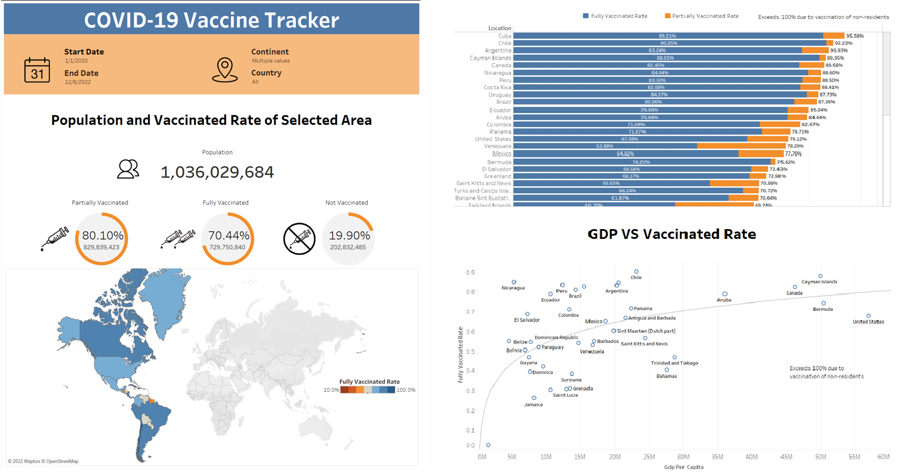

# ***COVID-19 Vaccination Tracker***  

## ***Software and Language***
Tableau Public 2023.2 
Microsoft SQL Server Management Studio 18 

## ***Project Overview***
Monitor and analyze the COVID-19 vaccination status and trends in diverse geographic regions.

- ***Key Metrics:*** Population statistics, mortality rates, accumulated vaccinations, and vaccination rates.
- ***Execution:*** Using SQL queries to extract and aggregate key metrics.
- ***Dashboard Creation:*** Exporting data to Tableau and building an interactive dashboard. 

## ***Results***
The dashboard will offer the following features:

- ***Filters:*** Filter data by custom timeframes and specific regions.
- ***Data Overview:*** Total population, vaccinated population, and vaccination rates (partial, full, and unvaccination).
- ***Visualization:*** A heatmap and stacked bar chart showing vaccination rates. A scatter plot showing the relation between GDP and the vaccination rate.  

  

## ***Data Collection***

Download data from the website Our World in Data: Coronavirus (COVID-19) Deaths.
***[Coronavirus (COVID-19) Deaths](https://ourworldindata.org/covid-deaths)***

The dataset spans from January 2020 to December 2022 and encompasses vital features, including countries, tests, cases, deaths, vaccinations, age, and population.
